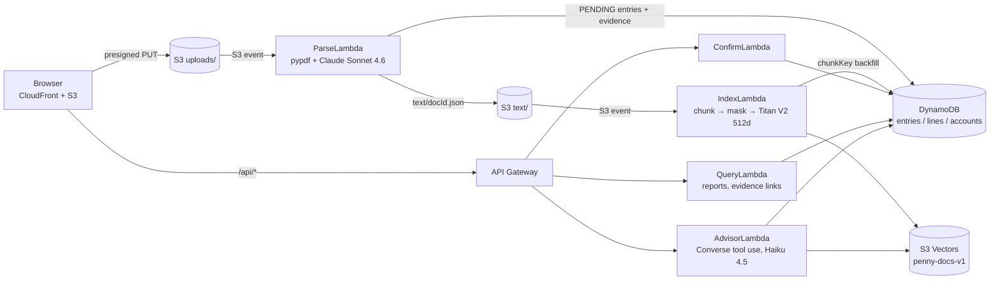

# Penny — a serverless double-entry ledger with a cited AI advisor

Penny turns bank statements and receipts into balanced double-entry journal entries. It links every entry to the exact line it came from in the source document, and it answers questions about your money with a tool-calling agent. Every figure in an answer cites a transaction, a ledger summary or a document chunk, and those citations are checked in code before the answer is returned.

It runs entirely on AWS serverless services (Lambda, DynamoDB, S3, S3 Vectors, Bedrock, CloudFront), so it costs nothing while idle.

> **Demo data only.** The public deployment has no authentication, so it must only ever hold synthetic data. Demo visitors (`?demo=true`) get an isolated session.

---

## What it does

| | |
|---|---|
| **Statement and receipt parsing** | Upload a PDF or a photo. One Claude Sonnet 4.6 call (Bedrock) returns balanced journal entries, the source line for each entry, and transcripts for pages that have no text layer. |
| **Evidence linking ("vouching")** | Each entry stores the line it came from. On text-layer PDFs that line is checked against independently extracted pypdf text, so the model can't invent evidence. **View source evidence** opens the original page through a 5-minute presigned link. |
| **Double-entry ledger** | Money is `Decimal` end to end. Debits must equal credits exactly before anything is written, both at parse time and at confirm time. Refunds are netted against the account they reverse. |
| **Base currency (USD)** | Documents in CNY, EUR, JPY or GBP are converted at the stored exchange rate. The rounding drift goes onto one line, so the entry still balances to the cent. The original amount and rate are kept. If a rate is missing or stale, the entry is flagged for review instead of being booked wrong. |
| **Cited advisor** | A Bedrock Converse tool-use agent with three read-only, typed tools: `search_documents`, `get_spending_summary` and `find_transactions`. Answers show **citation chips** that open the source. |
| **Duplicate detection** | Two layers: a file hash (the same document twice) and an entry hash (date + amount + description, the same transaction from another document). |
| **Budget alerts** | Monthly spending is compared against user limits and the 6-month average, with web-push notifications. |
| **Reports** | Income statement, balance sheet, net worth, tags, CSV export. |

## Evaluation

All numbers below come from [`docs/evaluation-results.md`](docs/evaluation-results.md), which is generated by [`eval/run_eval.py`](eval/run_eval.py). That file is the only source for figures quoted elsewhere.

The eval uses a deterministic synthetic dataset: 3 bank statements, 2 receipts, 26 gold transactions and 20 questions. It runs through the real pipeline in an isolated session, with **no LLM judge**.

| Metric | Claude Haiku 4.5 | Claude Sonnet 4.6 |
|---|---|---|
| Questions fully passed (tuned set) | 95% (19/20) | 100% (20/20) |
| Held-out paraphrased questions | 100% (8/8) | 100% (8/8) |
| Numeric exactness | 100% (18/18) | 100% (18/18) |
| Answers stating money that cite a source | 100% (16/16) | 100% (17/17) |
| Mean cost per question | **$0.0041** | $0.0133 |
| Latency p50 / p95 (laptop → Bedrock) | 2.3 s / 3.1 s | 3.8 s / 6.6 s |

Pipeline checks on the same dataset:
- **Evidence linking:** 24/24 statement lines are linked to the exact source line on the right page.
- **Retrieval:** hit@3 is 100%.

**How the eval was used.** The first run scored 14/20 for both models. Tracing each miss found:
- **Two real bugs.** Receipts were indexed under their upload month, so date-filtered search missed them. Keyword search also failed on punctuation ("Trader Joes" vs "Trader Joe's").
- **One unclear tool description.**
- **One over-strict scoring rule.**

After the fixes, the run history re-scores every stored run under the current rules, which shows how much of the gain came from code and how much from the rule change. The 8 held-out questions are paraphrases written after diagnosing the misses, so they show the fixes survive rewording; they are not an independent test set. With n = 20, one question is 5 percentage points, and each figure comes from a single run.

**Model choice.** The advisor runs on Haiku 4.5. On this eval it matches Sonnet within one question, at about a third of the cost and lower latency.

## Architecture



Ten Lambda functions, all defined in [`lib/finance-stack.ts`](lib/finance-stack.ts) with AWS CDK:
- **Ingestion:** Parse, Index.
- **Ledger:** Confirm, ManualEntry, Query, Export.
- **Advisor:** Advisor.
- **Scheduled:** ExchangeRate (weekly), MonthlyReport (monthly), PushNotification.

## Design decisions

- **Evidence is deterministic, not retrieved.** It comes from the parse call Penny already makes, so there is no second model call. It is validated against pypdf text, and account numbers are masked (`****9012`) before anything is stored, embedded or logged.
- **Citations are verified in code.** Every tool result carries a ref (`T1`, `S2`, `D3`).
  - The server removes refs the tools never produced and counts them.
  - It flags money in an answer that has no citation.
  - The frontend escapes all model and document text before rendering, which closes a prompt-injection path to XSS.
- **The agent can't do unchecked arithmetic.** Totals come from `get_spending_summary` (Decimal, refunds netted). The system prompt forbids figures the tools didn't return.
- **Time budget.** The agent works under API Gateway's 29 s limit:
  - a 26 s deadline;
  - each Bedrock or vector call starts only if enough time remains;
  - tool errors go back to the model;
  - throttling returns 503.
- **Crash-safe indexing.** Vector keys are deterministic (`{docId}#p{page}#c{n}`) and a write-ahead manifest is kept, so retries are idempotent and deleting a document never leaves orphan vectors.
- **Least-privilege IAM.**
  - The advisor can only query the vector index.
  - The indexer can only write to it, and only reads `text/`, so it can never re-trigger itself.
  - ParseLambda may only `GetItem` the exchange-rates table.
- **Session isolation.** Demo sessions are separate in DynamoDB, in vector metadata and in the evidence and confirm APIs. A request from another session gets 404.

## Cost

- **Idle:** about $0. There is no always-on compute or database: Lambda, DynamoDB on-demand, S3, S3 Vectors and CloudFront are all pay-per-use.
- **Per document:** one Claude Sonnet 4.6 parse call, plus Titan V2 embeddings for its chunks (a few hundred tokens per document).
- **Per advisor question:** $0.0041 mean with Haiku 4.5, measured on the eval above. Every request logs its tokens and `estCostUsd`, calculated from list prices in [`pricing.py`](lambda/common/penny_common/pricing.py). Logs never contain question text or amounts.

## Running it

**Requirements:** Node 22, Python 3.12, Docker (for the Lambda layer), AWS credentials, and Bedrock access to Claude Sonnet 4.6, Claude Haiku 4.5 and Titan Text Embeddings V2 in `us-east-1`.

```bash
npm ci
pip install -r requirements-dev.txt

python -m pytest test/lambda test/eval -q   # 393 tests
npx jest                                    # 43 tests (CDK + frontend helpers)

./scripts/build-layer.sh                    # builds the Python layer in the AWS SAM image
npx cdk deploy
npm run seed                                # chart of accounts (first deploy only)

aws s3 sync frontend/ s3://<BucketName>/ --exclude ".DS_Store"   # never --delete: the bucket also holds uploads
aws cloudfront create-invalidation --distribution-id <DistributionId> --paths "/*"
```

**Eval:** it costs about $1, runs manually, and needs AWS credentials.

```bash
python eval/run_eval.py setup     # uploads and confirms the synthetic corpus in a private session
python eval/run_eval.py run       # writes eval/results/run-*.json and docs/evaluation-results.md
```

CI (GitHub Actions) runs pytest, tsc, jest and `cdk synth` on every push, without AWS credentials. Operational procedures (re-indexing, DLQ replay, index migration) are in [`docs/runbooks/rag-operations.md`](docs/runbooks/rag-operations.md).

## Known limitations

- **No authentication.** Isolation relies on an unauthenticated `X-Session-Id` header, which a caller can spoof. That's why the public demo must hold synthetic data only.
- **Image evidence is weaker.** Evidence for images and scanned pages is checked only against Claude's own transcript, not against an independent text layer.
- **Exchange rates are current, not historical.** Foreign-currency entries use the latest stored rate, not the rate on the transaction date.
- **Duplicate checks scan the entries table.** That's fine at personal scale; a GSI is the next step.
- **The eval is small.** It has 20 tuned questions and 8 held-out ones, single runs, and synthetic data only. The 512 vs 1024-dimension ablation and an old-advisor baseline were not measured.

---

Built for Northeastern University CS6620 Cloud Computing (Spring 2026), then extended with the RAG and evaluation work described in [`docs/superpowers/`](docs/superpowers/).
